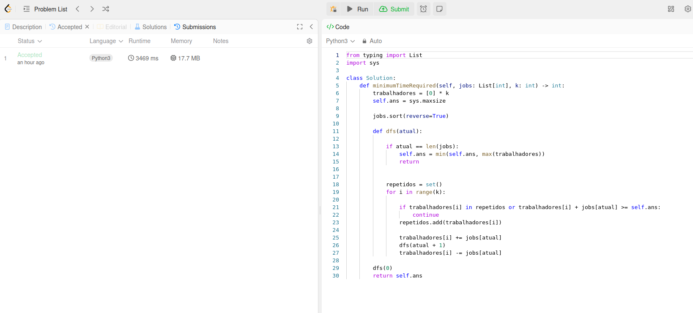

# Greed LeetCode

**Conteúdo da Disciplina**: Algoritmos Ambiciosos 

Questões de Algoritmos ambiciosos resolvidas no LeetCode pelos alunos Luis Miranda e Vinicius Mendes

## Alunos
|Matrícula | Aluno |
| -- | -- |
| 21/1063200 |  LUIS EDUARDO CARNEIRO MIRANDA |
| 21/1063265 |  VINICIUS MENDES MARTINS |

## Sobre 
Resolução de questões da plataforma LeetCode que contemplam os níveis médio e difícil de dificuldade. O objetivo é abordar o conteúdo lecionado em sala de aula de forma simples e intuitiva, com códigos facilmente legíveis.

Os exercícios abordados são os seguintes
| Código do Problema | Nome do Problema | Dificuldade |
| ------------------ | ---------------- | ----------- |
| [1723](https://leetcode.com/problems/find-minimum-time-to-finish-all-jobs/description/) | Find Minimum Time to Finish All Jobs | Dificil |
| [2406](https://leetcode.com/problems/divide-intervals-into-minimum-number-of-groups/description/) | Divide Intervals Into Minimum Number of Groups| Média |
|  | | |

## Vídeo explicando cada questão

| Problema |
| ------------------ |
| | 
| | 
| |

## Screenshots
Adicione 3 ou mais screenshots do projeto em funcionamento.

### Find Minimum Time to Finish All Jobs

## Instalação 
**Linguagem**: Python

## Uso
Para testar os códigos, basta entrar na plataforma LeetCode, procurar pelos exercícios e colar na aba Code.
